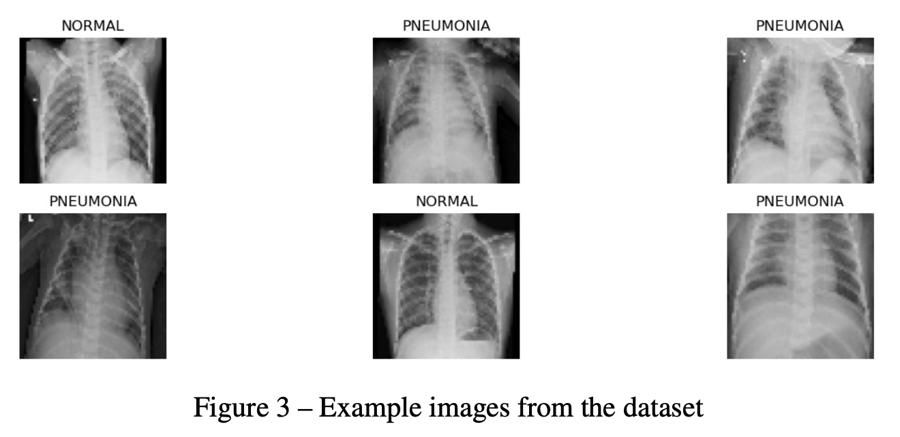
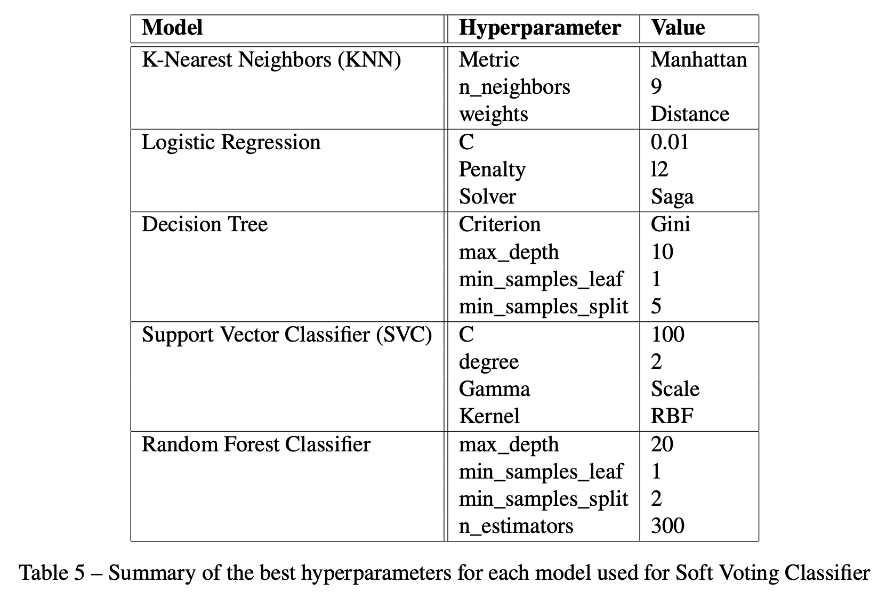
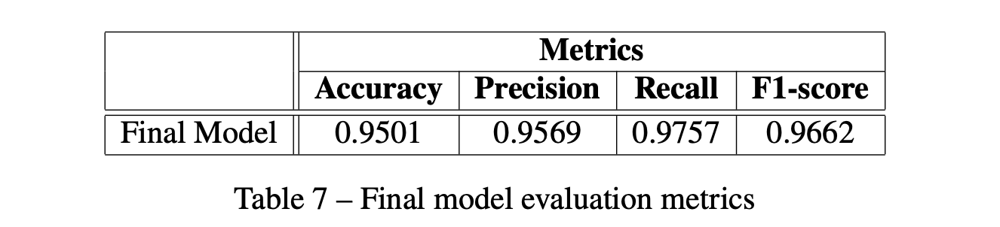

<!----------------------------------------------------------------------->
<a name="readme-top"></a>
<!----------------------------------------------------------------------->

<table width="100%" style="border: none;">
  <tr>
    <!-- <td align="left" style="border: none;"><b>LE GOURRIEREC Titouan</b></td> -->
    <td align="right" style="border: none;">
      <a href="https://www.linkedin.com/in/titouanlegourrierec"></a>
      <a href="mailto:titouanlegourrierec@icloud.com"></a>
      <!-- <a href="https://titouanlegourrierec.github.io"></a> -->
    </td>
  </tr>
</table>

<!----------------------------------------------------------------------->
<!----------------------------------------------------------------------->

<!-- PROJECT LOGO -->
<br />
<div align="center">
  <!-- <a href="https://github.com/othneildrew/Best-README-Template">
    
  </a> -->

  <h3 align="center">Pneumonia XRay Classification </h3>

  <p align="center">
     LE GOURRIEREC Titouan
    <!-- <br />
    <a href="https://github.com/othneildrew/Best-README-Template"><strong>Explore the docs »</strong></a>
    <br /> -->
    <br />
    <!-- <a href="https://github.com/othneildrew/Best-README-Template">View Demo</a>
    ·
    <a href="https://github.com/othneildrew/Best-README-Template/issues/new?labels=bug&template=bug-report---.md">Report Bug</a>
    · -->
    <a href="https://github.com/titouanlegourrierec/PneumoniaXRayClassification/issues/new">Report a bug · Request Feature</a>
  </p>
</div>


<!-- TABLE OF CONTENTS -->
<details>
  <summary>Table of Contents</summary>
  <ol>
    <li>
      <a href="#about-the-project">About The Project</a>
      <ul>
        <li><a href="#built-with">Built With</a></li>
      </ul>
    </li>
    <li>
      <a href="#getting-started">Getting Started</a>
      <ul>
        <li><a href="#prerequisites">Prerequisites</a></li>
      </ul>
    </li>
    <li><a href="#usage">Usage</a></li>
    <li><a href="#license">License</a></li>
    <li><a href="#contact">Contact</a></li>
  </ol>
</details>

<!----------------------------------------------------------------------->
<!----------------------------------------------------------------------->

## About The Project

<p align="center">
  
</p>

This project focuses on classifying chest X-rays as either healthy or pneumonia-affected. Several machine learning algorithms were tested, including K-Nearest Neighbors (KNN), Logistic Regression, Decision Trees, Support Vector Classifier (SVC), Random Forest, Gradient Boosting Classifier, and a Voting Classifier.

To address the issue of imbalanced classes, various techniques were employed, such as Random Over Sampling, SMOTE (Synthetic Minority Over-sampling Technique), Random Under Sampling, and Weight Modification.

For each algorithm, Grid Search was used to fine-tune the hyperparameters. The final model was evaluated using cross-validation, and learning curves were analyzed to assess whether further evaluation was needed.

The final model chosen is a soft voting classifier, which combines the outputs of the different models, configured as follows:

<p align="center">
  
</p>

Below are the evaluation metrics for this model:

<p align="center">
  
</p>

You can find the project report here: `report.pdf`

<!----------------------------------------------------------------------->
<p align="right">(<a href="#readme-top">back to top</a>)</p>
<!----------------------------------------------------------------------->


### Built With
* [![Python][Python-badge]][Python-url]
* [![OpenCV][OpenCV-badge]][OpenCV-url]
* 


<!----------------------------------------------------------------------->
<p align="right">(<a href="#readme-top">back to top</a>)</p>
<!----------------------------------------------------------------------->

## Getting Started
### Prerequisites 

Before running this project, make sure you have installed the necessary dependencies. You can do this by installing the packages listed in the requirements.txt file:

```bash
pip install -r requirements.txt
```

Ensure you have Python installed and that you're using a virtual environment if needed.

-> For the data, please follow the instructions in the `Dataset_Link.pdf` file.


<!----------------------------------------------------------------------->
<p align="right">(<a href="#readme-top">back to top</a>)</p>
<!----------------------------------------------------------------------->


## Usage

To use this project, just change the variable `path` in the `Images Import` part of the file `project.ipynb`


<!----------------------------------------------------------------------->
<p align="right">(<a href="#readme-top">back to top</a>)</p>
<!----------------------------------------------------------------------->


## License

Distributed under the MIT License. See [`LICENSE`](https://github.com/titouanlegourrierec/PneumoniaXRayClassification/blob/main/LICENCE) for more information.

<!----------------------------------------------------------------------->
<p align="right">(<a href="#readme-top">back to top</a>)</p>
<!----------------------------------------------------------------------->

## Contact

LE GOURRIEREC Titouan - [titouanlegourrierec@icloud.com](mailto:titouanlegourrierec@icloud.com)

Project Link: [https://github.com/titouanlegourrierec/PneumoniaXRayClassification](https://github.com/titouanlegourrierec/PneumoniaXRayClassification)


<!----------------------------------------------------------------------->
<p align="right">(<a href="#readme-top">back to top</a>)</p>
<!----------------------------------------------------------------------->


<!-- MARKDOWN LINKS & IMAGES -->


[Python-badge]: https://img.shields.io/badge/python-3670A0?style=for-the-badge&logo=python&logoColor=ffdd54
[Python-url]: https://www.python.org

[OpenCV-badge]: https://img.shields.io/badge/opencv-%23white.svg?style=for-the-badge&logo=opencv&logoColor=white
[OpenCV-url]: https://opencv.org